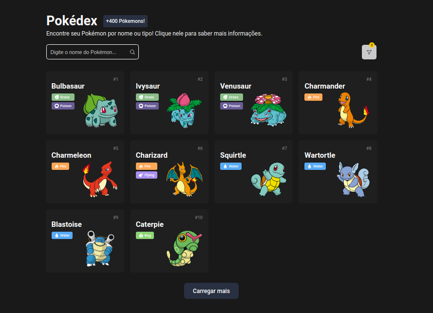

<h1 align="center">
    Pokédex 
</h1>

    Encontre seu Pokémon de forma simples, rápida e intuitiva! 

  <a href="#objetivo">Objetivo</a>&nbsp;&nbsp;&nbsp;|&nbsp;&nbsp;&nbsp;
  <a href="#tecnologias">Ferramentas</a>&nbsp;&nbsp;&nbsp;|&nbsp;&nbsp;&nbsp;
  <a href="#cores">Cores usadas</a>&nbsp;&nbsp;&nbsp;|&nbsp;&nbsp;&nbsp;
  <a href="#ideias">Ideias realizadas</a>&nbsp;&nbsp;&nbsp;|&nbsp;&nbsp;&nbsp;
  <a href="#projeto">Projeto</a>

  

  

<h2 id="objetivo">🚀 <b>Objetivo:</b></h2>

- Explorar o mundo Pokémon através do consumo de uma **API REST** para a criação de uma Pokédex incrível!

<h2 id="tecnologias">🔧 <b>Ferramentas:</b></h2>

- HTML e CSS
- JavaScript
- Git e GitHub
- [http-server](https://www.npmjs.com/package/http-server)
- Layouts:

    - [Dark UI Desing - Pokédex | Daniela Resende](https://www.behance.net/gallery/168671299/Dark-UI-Study-Pokdex?tracking_source=search_projects%7Cpokedex)

    - [Pokedex App - Case Study | Simone Cavallini](https://www.behance.net/gallery/158115601/Pokedex-App-Case-Study?tracking_source=search_projects%7CPokedex)

- API [PokéApi](https://pokeapi.co/)

- Icons:
    - [Phosphor Icons](https://phosphoricons.com/)
    - [Pokemons Types | duiker101](https://github.com/duiker101/pokemon-type-svg-icons)

<h2 id="cores">🎨 <b>Cores usadas:</b></h2>

| Cor               | Hexadecimal                                                      |
| ----------------- | ---------------------------------------------------------------- |
| Normal            |  #A6A877 |
| Grass             |  #8BBE8A |
| Fire              |  #FFA756 |
| Water             |  #58ABF6 |
| Electric          |  #F2CB55 |
| Ice               |  #98D5D7 |
| Ground            |  #DFBF69 |
| Flying            |  #A98FF0 |
| Poison            |  #695C97 |
| Fighting          |  #BF3029 |
| Psychic           |  #F65687 |
| Dark              |  #725847 |
| Rock              |  #B8A137 |
| Bug               |  #8BD674 |
| Ghost             |  #6E5896 |
| Steel             |  #B9B7CF |
| Dragon            |  #6F38F6 |
| Fairy             |  #F9AEC7 |

<h2 id="ideias">💡 <b>Ideias realizadas:</b></h2>

- Dark UI
- Filtro pelo nome e tipo do Pokémon
- Curtir o Pokémon e armazenar seu estado (curtido ou não curtido) no LocalStorage 
- &#43;400 Pokémons
- Mais informações sobre o Pokémon:
    - **Sobre**:
        - Altura
        - Peso
        - Geração
        - Habitat
        - É ou não mítico (tão difícil de achar que é considerado um mito ou lenda)
        - É ou não lendário
        - Forma
        - Grupo pertencente
        - Habilidades
        - Tipo
    - **Status**:
        - HP
        - Attack
        - Defense
        - Sp.Atk (Special Attack)
        - Sp.Def (Special Defense)
        - Speed
    - **Movimentos**:
        - 15 movimentos realizados pelo Pokémon

<h2 id="projeto">💻 <b>Projeto:</b></h2>

- [Veja o projeto online](https://dark-pokedex.vercel.app/)

 

  Feito com 💜 por mim | Bruno Souza

